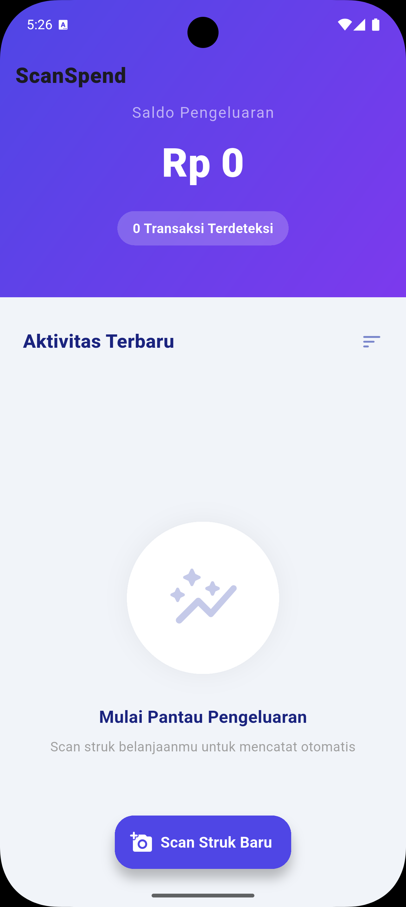

# 💸 ScanSpend - Smart Receipt Scanner & Expense Tracker

**ScanSpend** adalah aplikasi manajemen pengeluaran berbasis Flutter yang memanfaatkan teknologi **AI (OCR)** untuk membaca struk belanja secara otomatis. Didesain dengan antarmuka modern (Material 3) untuk memberikan pengalaman pelacakan keuangan yang cepat, akurat, dan elegan bagi pengguna di Indonesia.

## ✨ Fitur Utama

- **AI-Powered OCR**: Mengekstraksi data tanggal dan total biaya dari berbagai jenis struk (Alfamart, Indomaret, Kafe, SPBU, dll) secara otomatis menggunakan Google ML Kit.
- **Smart Parsing for Indonesia**: Logika cerdas untuk menangani format mata uang Rupiah (titik/koma) dan istilah lokal (Total, Jumlah, Tunai, Kembali).
- **Modern UI/UX**: Antarmuka bersih dengan tema Material 3, gradasi Indigo-Violet, dan navigasi yang intuitif.
- **Image Cropper**: Fitur potong gambar terintegrasi untuk meningkatkan akurasi pembacaan teks.
- **Real-time Dashboard**: Pantau total pengeluaran Anda secara instan di bagian header aplikasi.

## 🛠️ Stack Teknologi

- **Framework**: [Flutter](https://flutter.dev) (Latest Version)
- **OCR Engine**: [Google ML Kit Text Recognition](https://developers.google.com/ml-kit/vision/text-recognition)
- **Image Processing**: `image_picker` & `image_cropper`
- **Formatting**: `intl` untuk format mata uang IDR dan tanggal lokal.

## 📸 Tampilan Aplikasi



## 🚀 Cara Menjalankan

### Persiapan

1. Pastikan Anda sudah menginstal Flutter SDK.
2. Clone repositori ini:
   ```bash
    git clone [https://github.com/username/scanspend.git](https://github.com/username/scanspend.git)
   ```

Konfigurasi Android
Karena menggunakan Google ML Kit dan Image Cropper, pastikan file android/app/build.gradle menggunakan minSdkVersion 21:

```bash
  defaultConfig {
      minSdkVersion 21
  }
```

Daftarkan UCropActivity di android/app/src/main/AndroidManifest.xml:

```bash
  <activity
      android:name="com.yalantis.ucrop.UCropActivity"
      android:screenOrientation="portrait"
      android:theme="@style/Theme.AppCompat.Light.NoActionBar"/>
```

### Instalasi

Jalankan perintah berikut di terminal:

```bash
  flutter pub get
  flutter run
```

🤝 Kontribusi
Kontribusi selalu terbuka! Jika Anda memiliki saran atau menemukan bug, silakan buka Issue atau kirimkan Pull Request.

Dibuat dengan ❤️ oleh [Faik Irkham](https://faikirkham.my.id)
